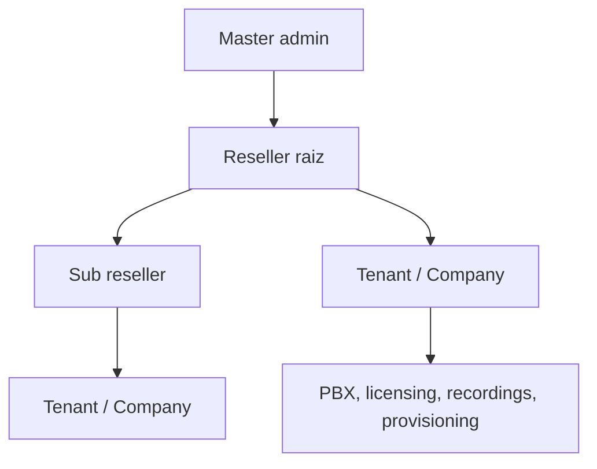
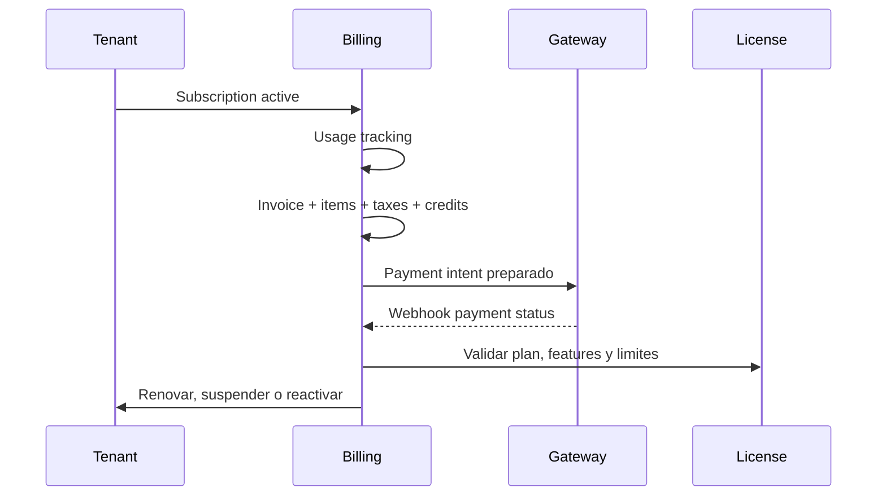

# Billing Engine + Reseller Platform

UC200 prepara una capa enterprise para operar master admin, resellers y tenants con aislamiento por ownership.

## Arquitectura reseller



- `resellers` permite jerarquia multi nivel con `parent_reseller_id`.
- `reseller_companies` asigna cada tenant a un reseller.
- Super admin ve todo.
- Un reseller solo opera tenants asignados a su ownership.
- Branding, dominio personalizado y limites quedan preparados en JSON para evolucionar sin romper schema.

## Billing flow



## Entidades

- `billing_subscriptions`: plan, periodo, renovacion, grace period y estado.
- `billing_addons`: WhatsApp, AI, CRM, Queue y WebRTC.
- `billing_subscription_addons`: addons por suscripcion.
- `billing_invoices` y `billing_invoice_items`: facturacion detallada.
- `billing_taxes`: impuestos por reseller o tenant.
- `billing_balances` y `billing_credits`: saldos y creditos.
- `billing_usage_records`: consumo por metricas.
- `billing_gateway_configs`: configuracion Stripe, MercadoPago y PayPal.
- `billing_payment_transactions`: transacciones normalizadas.
- `billing_notifications`: automatizacion de avisos.

## Automatizacion

`BillingService::suspendExpiredTenants()` suspende tenants con suscripcion vencida fuera del grace period y marca la suscripcion como `past_due`. La capa queda lista para jobs programados de:

- renovacion automatica;
- expiracion;
- suspension;
- notificaciones;
- reactivacion por pago.

## Payment gateways

La abstraccion inicial vive en `app/Services/Payments`:

- `PaymentGateway`
- `StripeGateway`
- `MercadoPagoGateway`
- `PayPalGateway`
- `PaymentGatewayManager`

No hace llamadas externas todavia; normaliza la interfaz para preparar intents, manejar webhooks y reembolsos.

## UI

Pantallas compactas enterprise:

- `/billing`
- `/billing/resellers`
- `/billing/tenants`
- `/billing/subscriptions`
- `/billing/invoices`
- `/billing/usage`

## API

Endpoints read-only iniciales:

- `GET /api/v1/resellers`
- `GET /api/v1/billing/subscriptions`
- `GET /api/v1/billing/invoices`
- `GET /api/v1/billing/usage`
- `POST /api/v1/billing/webhook`

Scopes:

- `resellers:read`
- `billing_subscriptions:read`
- `billing_invoices:read`
- `billing_usage:read`

## Instalacion

Para instalaciones existentes:

```bash
mysql -u uc200_user -p uc200_core < database/updates/2026_05_18_billing_reseller_engine.sql
```

Para instalaciones nuevas, `database/install.sql` referencia la migracion del Billing Engine.
