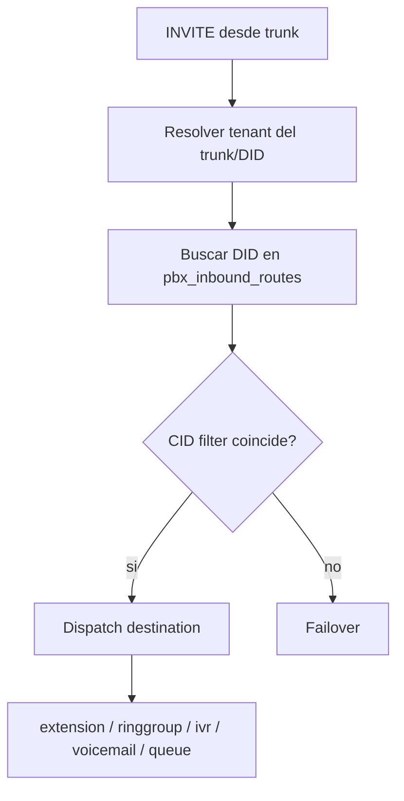
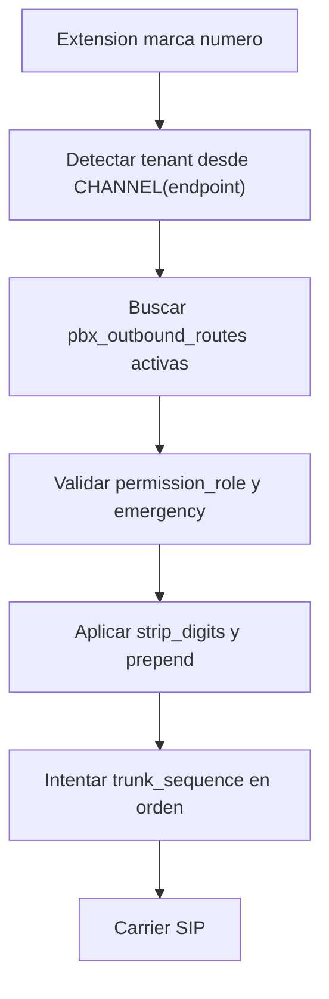

# UC200 Communications

Guia de la capa de comunicaciones de UC200. La experiencia visible se centra en identidades de comunicacion, perfiles de llamadas, clientes UC200 y lineas SIP. El detalle tecnico del motor interno se conserva solo para superadmin/engineer.

## Conceptos para usuario final

- **Identidad de comunicacion**: representa la extension UC200 de una persona o equipo.
- **Perfil de llamadas**: define como se enrutan sus llamadas internas, externas o de grupos.
- **Metodo de conexion**: forma tecnica de enlazar clientes o telefonos, gestionada automaticamente por UC200.
- **UC200 Softphone**: experiencia principal de llamadas desde navegador.
- **Softphone externo temporal/pruebas**: opcion de compatibilidad avanzada para validaciones o migraciones.
- **Linea SIP / Proveedor SIP**: conexion con operador o servicio externo.
- **Conectividad remota**: ajustes para usuarios y dispositivos fuera de la red local.

## Conceptos tecnicos internos

Las secciones siguientes ya pueden mencionar el motor interno, tablas realtime y objetos SIP. Esta parte esta pensada para implementacion, soporte y troubleshooting tecnico.

## CRM + PBX

UC200 ya incluye una primera capa de integracion CRM/PBX:

- contacto vinculado a extension, DID o telefono
- caller ID lookup por movil, oficina o DID
- historial `crm_call_logs`
- dashboard PBX con llamadas hoy, perdidas y agentes online
- abstraccion de originate conectada a AMI Gateway base

La base actual resuelve `Originate` real por AMI cuando el gateway esta habilitado. ARI y el listener de eventos quedan preparados para una fase posterior con worker dedicado.

## Security Center

UC200 ahora agrega una primera capa operativa de seguridad PBX/SIP desde el panel:

- dashboard de ataques SIP
- lectura de `fail2ban`
- IPs bloqueadas
- firewall `iptables`
- whitelist / blacklist
- auditoria de bans manuales y reinicios

La documentacion detallada vive en `docs/security.md` y `docs/pbx-security.md`.

## AMI Gateway

UC200 agrega una capa inicial AMI para controlar llamadas desde:

- panel PBX
- contactos CRM
- softphone web

Configuracion disponible en la UI PBX:

- host
- port
- username
- password
- enabled
- status

Valores recomendados por defecto:

```text
Host: 127.0.0.1
Port: 5038
Enabled: no
Originate context: usar contexto de la extension
```

Las credenciales se guardan cifradas en `settings` usando `APP_KEY` cuando esta disponible. Si `APP_KEY` no existe, UC200 usa una derivacion local como fallback y recomienda configurar una llave propia.

### Flujo de click-to-call

1. El usuario elige un contacto o extension destino.
2. UC200 obtiene la extension del usuario logueado.
3. `PbxOriginateService` llama a `AmiService`.
4. Asterisk origina a `PJSIP/{endpoint}`.
5. Cuando el usuario contesta, el canal entra al contexto configurado y marca el destino.

Por defecto UC200 usa:

- `pbx.ami.originate_context` si esta configurado.
- Si no existe, usa el `context` de la extension origen.

Esto mantiene compatibilidad con el dialplan realtime actual y evita romper extensiones existentes.

## Alcance

- CRUD de extensiones SIP.
- Cada extension crea/edita `ps_endpoints`, `ps_auths` y `ps_aors`.
- CRUD de `ps_transports`.
- Separacion multiempresa por `company_id` y `context`.
- UUIDs, soft deletes y auditoria.
- Estado SIP preparado (`sip_status`).
- Presencia preparada (`presence_status`).
- Password SIP generado con `random_bytes()`.
- Auth User separado del numero visible, estilo 3CX.

Incluye AMI Gateway base, WebRTC browser softphone con WSS/DTLS/ICE, listener realtime enterprise por Socket.IO y una plantilla inicial de dialplan para llamadas internas entre extensiones del mismo tenant. ARI queda preparado para una fase posterior.

## WebRTC en PBX

El dashboard PBX ya incluye una seccion `WebRTC Gateway` para controlar:

- `Enable WebRTC`
- `SIP domain`
- `WebSocket path`
- `STUN server`
- `TURN server`
- `DTLS enable`
- `ICE support`
- `Session timeout`

Por defecto UC200 opera en modo **WebRTC integrado** y el softphone construye `wss://{dominio_actual}/ws`. El puerto y un override WSS absoluto siguen disponibles solo en opciones avanzadas para administradores. Con esto UC200 puede preparar endpoints WebRTC sin tocar el resto del realtime PJSIP existente.

## Tablas internas

- `ps_endpoints`
- `ps_auths`
- `ps_aors`
- `ps_transports`

Los nombres mantienen compatibilidad con Asterisk Realtime. Las columnas extra (`uuid`, `company_id`, `deleted_at`, estados internos) son para el core administrativo.

## Contexto tenant

Por defecto las extensiones usan:

```text
contexto_principal
```

Temporalmente se conserva `contexto_principal`. Los IDs internos Realtime separan tenant y extension:

```text
ps_endpoints.id = tenant_{company_id}_{extension_number}
ps_endpoints.auth = auth_{auth_username}
ps_endpoints.aors = tenant_{company_id}_{extension_number}
ps_endpoints.identify_by = auth_username
```

Si el dialplan se separa por tenant mas adelante, el contexto recomendado es `tenant_{company_id}`. Mientras se use `contexto_principal`, el dialplan debe enrutar considerando que `endpoint.id` ya contiene tenant y extension.

## Dialplan inicial

UC200 mantiene una extension visible (`1001`) separada del endpoint real (`tenant_1_1001`). Por eso, si un usuario marca `1002`, el dialplan debe convertir esa marcacion visible al endpoint PJSIP del mismo tenant:

```text
tenant_{company_id}_{extension_number}
```

Incluye la plantilla:

```bash
cp /var/www/uc200-core/config/asterisk/extensions.conf.sample /etc/asterisk/extensions_uc200.conf
```

Luego agrega esta linea al final de `/etc/asterisk/extensions.conf` si no existe:

```ini
#include extensions_uc200.conf
```

Recarga el dialplan:

```bash
asterisk -rx "dialplan reload"
asterisk -rx "dialplan show contexto_principal"
```

La plantilla usa `${CHANNEL(endpoint)}` para detectar el endpoint origen, extraer el `company_id` de `tenant_1_1001` y marcar `PJSIP/tenant_1_1002`. Esto mantiene aisladas empresas distintas que puedan tener la misma extension visible.

Si Asterisk muestra un error como:

```text
Unable to create PJSIP channel - endpoint '1-1002' was not found
```

el dialplan todavia esta usando un formato viejo como `PJSIP/${TENANT}-${EXTEN}`. Debe marcar:

```text
PJSIP/tenant_${TENANT}_${EXTEN}
```

## Credenciales SIP seguras

La extension visible no es el usuario de autenticacion SIP.

Ejemplo:

```text
Extension number: 1001
Caller ID: "1001" <1001>
Auth User: uXs238dsjDS
Auth Password: generado aleatorio seguro
Endpoint interno: tenant_1_1001
Auth ID interno: auth_uXs238dsjDS
AOR ID interno: tenant_1_1001
```

Campos Realtime:

```text
ps_endpoints.id = internal_endpoint_id
ps_endpoints.auth = internal_auth_id
ps_endpoints.aors = internal_aor_id
ps_endpoints.callerid = callerid
ps_endpoints.identify_by = auth_username
ps_auths.id = internal_auth_id
ps_auths.auth_type = digest
ps_auths.username = auth_username
ps_auths.password = auth_password
ps_auths.realm = asterisk
ps_aors.id = internal_aor_id
```

## Registrar Zoiper

Usa los datos mostrados en el listado de extensiones:

```text
Username: SIP Username / Endpoint interno
Auth User: auth_username
Password: auth_password
Caller ID / Display Name: extension_number
Domain: servidor PBX
```

No uses el numero de extension como usuario SIP ni como Auth User.

Configuracion recomendada para Zoiper u otro softphone durante el MVP:

```text
Account type: SIP manual
Domain: IP o dominio del PBX
Username: SIP Username / Endpoint interno, ejemplo tenant_1_1001
Authentication username: Auth User, ejemplo uOiCpdrO1lwlCsca9
Password: Auth Password
Caller ID / Display Name: extension_number, ejemplo 1001
Outbound Proxy: vacio
Transport: UDP
STUN / ICE: OFF inicialmente
Codecs: solo ulaw y alaw
Video codecs: OFF
```

Para que Asterisk encuentre endpoints usando el usuario de autenticacion aleatorio, `ps_endpoints.identify_by` debe quedar en:

```text
auth_username
```

Esto mantiene el modelo seguro donde `extension_number` visible es distinto de `auth_username`.

## UX de extensiones

El formulario de extensiones esta pensado para usuarios no tecnicos. Por defecto solo muestra:

- Empresa.
- Numero de extension.
- Nombre o etiqueta.
- Email.
- Caller ID visible.
- Tipo de dispositivo: softphone externo, WebRTC o telefono IP.
- Grabacion habilitada.
- Voicemail habilitado.
- Estado.

UC200 genera automaticamente los valores tecnicos:

- SIP Username / endpoint interno.
- Auth User aleatorio seguro.
- Auth Password aleatorio seguro.
- AOR.
- Contexto.
- NAT recomendado.
- Codecs default.
- `identify_by = auth_username`.

Las opciones tecnicas quedan dentro de **Opciones avanzadas**:

- SIP Username.
- Auth User.
- Auth Password.
- AOR / Endpoint.
- Contexto.
- Transport.
- Allow / Disallow.
- Direct media.
- Force rport.
- Rewrite contact.
- RTP symmetric.
- NAT options.
- Identify by.
- Codecs.

## Configurar softphone externo

En el listado o detalle de extension usa **Configurar Softphone**. El modal muestra lo necesario para Zoiper, Linphone o MicroSIP:

```text
Servidor: dominio o IP del PBX
Puerto: 5060 para UDP/TCP/TLS
Transporte: UDP o TLS para softphone externo; WebRTC integrado usa /ws en el mismo dominio del panel
Auth User: usuario aleatorio seguro
Auth Password: password aleatorio seguro
Display name: nombre visible
Extension number: 1001
Email: usuario@empresa.com
```

El password queda oculto por defecto. Usa Mostrar/Ocultar o Copiar configuracion solo cuando estes entregando credenciales al usuario final. Regenerar credenciales invalida el registro actual del softphone hasta actualizar el nuevo password.

El email de la extension es un dato principal. Debe ser unico dentro de la empresa y permite enlazar login por extension, directorio y futuras sincronizaciones con Microsoft 365 o Google Workspace.

Despues de actualizar Realtime, recarga PJSIP:

```bash
asterisk -rx "pjsip reload"
```

En `pjsip.conf`, el orden global de identificadores debe incluir `auth_username`:

```ini
[global]
type=global
endpoint_identifier_order=ip,auth_username,username,anonymous
```

Puedes verificar que Asterisk tenga el identificador cargado con:

```bash
asterisk -rx "pjsip show identifiers"
```

## Audio RTP y NAT

Si la llamada se establece pero no hay audio, revisa RTP/NAT. En clientes moviles es normal que el SDP anuncie una IP privada como `172.19.x.x`; Asterisk debe responder usando RTP simetrico.

Si el PBX esta detras de NAT 1:1, configura el transport UDP con la IP publica del PBX:

```sql
UPDATE ps_transports
SET external_media_address = '209.46.122.236',
    external_signaling_address = '209.46.122.236'
WHERE id = 'transport-udp';
```

Si el VPS tiene IP publica directa en la interfaz, deja esos campos en `NULL`:

```sql
UPDATE ps_transports
SET external_media_address = NULL,
    external_signaling_address = NULL,
    local_net = NULL
WHERE id = 'transport-udp';
```

Verifica que los endpoints tengan NAT habilitado:

```sql
UPDATE ps_endpoints
SET direct_media = 'no',
    disable_direct_media_on_nat = 'yes',
    force_rport = 'yes',
    rewrite_contact = 'yes',
    rtp_symmetric = 'yes'
WHERE deleted_at IS NULL;
```

Para mantener a Asterisk como ancla de audio durante el MVP, desactiva el bridge RTP nativo:

```bash
asterisk -rx "module unload bridge_native_rtp.so"
printf '\nnoload => bridge_native_rtp.so\n' >> /etc/asterisk/modules.conf
systemctl restart asterisk
```

## Queue / Call Center

El flujo PBX ahora puede entregar llamadas a queues empresariales. El modulo vive en `/call-center` y usa tablas dedicadas:

- `pbx_queues`
- `pbx_queue_members`
- `pbx_queue_agent_states`
- `pbx_queue_events`
- `pbx_queue_metrics`

Las rutas inbound, IVR y ring groups deben enviar hacia el destino `queue` usando el identificador interno recomendado:

```text
tenant_{company_id}_{queue_extension}
```

La documentacion completa esta en `docs/queues.md`.

Configura RTP en Asterisk:

```bash
cp /var/www/uc200-core/config/asterisk/rtp.conf.sample /etc/asterisk/rtp.conf
```

Para dejar permanente el bloqueo de RTP nativo puedes usar la plantilla:

```bash
cat /var/www/uc200-core/config/asterisk/modules.conf.sample >> /etc/asterisk/modules.conf
systemctl restart asterisk
```

Abre puertos UDP en firewall/VPS:

```bash
ufw allow 5060/udp
ufw allow 10000:20000/udp
```

Recarga:

```bash
asterisk -rx "pjsip reload"
asterisk -rx "module reload res_rtp_asterisk.so"
```

Diagnostico en vivo:

```bash
asterisk -rvvvvv
rtp set debug on
```

Durante una llamada debes ver paquetes RTP entrando y saliendo. Si solo ves RTP en una direccion, el problema es NAT/firewall del lado que no envia o no recibe.

## Seguridad SIP inicial

Recomendaciones para publicar PJSIP en Internet durante el MVP:

- Mantener `ps_endpoints.identify_by = auth_username`.
- Mantener `endpoint_identifier_order=ip,auth_username,username,anonymous`.
- No definir endpoint anonymous en produccion.
- Usar `auth_username` aleatorio, nunca el numero visible de extension.
- Mantener `auth_type=digest` y `realm=asterisk`.
- Usar solo codecs `ulaw,alaw` hasta validar cada softphone.
- Mantener `direct_media=no` por default; activarlo solo si se conoce la topologia de red.
- Ocultar version y banner en proxy/firewall si se publica detras de un SBC o reverse SIP edge.

Fail2ban:

```bash
apt update
apt install -y fail2ban
cp /var/www/uc200-core/config/fail2ban/asterisk-uc200.local /etc/fail2ban/jail.d/asterisk.local
systemctl restart fail2ban
fail2ban-client status asterisk
```

Bloqueo manual de un scanner:

```bash
iptables -I INPUT -s 51.68.122.238 -j DROP
```

Rate limit basico para registros SIP con `iptables`:

```bash
iptables -A INPUT -p udp --dport 5060 -m hashlimit \
  --hashlimit-name SIPREGISTER --hashlimit-above 20/minute \
  --hashlimit-burst 10 --hashlimit-mode srcip -j DROP
```

Puertos recomendados:

```bash
iptables -A INPUT -p udp --dport 5060 -j ACCEPT
iptables -A INPUT -p udp --dport 5061 -j ACCEPT
iptables -A INPUT -p udp --dport 10000:20000 -j ACCEPT
```

Deteccion de auth failures:

```bash
grep "Failed to authenticate" /var/log/asterisk/messages
journalctl -u asterisk | grep "Failed to authenticate"
```

El archivo `config/asterisk/pjsip-security.conf.sample` contiene notas base para el bloque `[global]`.

## Grabacion de llamadas

UC200 prepara grabacion con `MixMonitor` y metadata en `pbx_recordings`.

Estructura de archivos:

```text
/recordings/{tenant_id}/{yyyy}/{mm}/{dd}/
```

La tabla guarda:

- caller
- callee
- start/end
- duration
- file_path
- uniqueid/linkedid
- direction: `internal`, `inbound`, `outbound`

Instala el AGI:

```bash
chmod +x /var/www/uc200-core/bin/asterisk/uc200_recording_agi.php
mkdir -p /recordings
chown -R asterisk:asterisk /recordings
```

El dialplan sample `config/asterisk/extensions.conf.sample` incluye:

- `MixMonitor(${UC200_RECORDING_FILE},b)`
- AGI `uc200_recording_agi.php start`
- AGI `uc200_recording_agi.php end` en extension `h`
- switches `UC200_RECORD_INTERNAL`, `UC200_RECORD_INBOUND`, `UC200_RECORD_OUTBOUND`

Para inbound/outbound, reutiliza el subrutina `uc200-recording` cambiando `UC200_DIRECTION` a `inbound` u `outbound` antes del `Dial()`.

## Flujo empresarial de llamadas

UC200 incluye una capa inicial para modelar call-flow por tenant sin mezclar empresas:

- Ring Groups: `pbx_ring_groups`
- IVR: `pbx_ivrs`
- SIP Trunks: `pbx_sip_trunks`
- Inbound Routes: `pbx_inbound_routes`
- Outbound Routes: `pbx_outbound_routes`

Todas las tablas tienen `company_id`, `uuid`, `status`, `deleted_at` e indices por tenant. Los controladores filtran por `company_id` para usuarios que no son `super-admin`, y las operaciones de edicion/eliminacion vuelven a validar ownership antes de tocar registros.

### Ring Groups

Estrategias soportadas en la configuracion:

- `ringall`
- `hunt`
- `memoryhunt`
- `leastrecent`
- `fewestcalls`
- `random`

`members` guarda extensiones o endpoints internos separados por coma/salto de linea. El dialplan debe resolverlos a `PJSIP/tenant_{company_id}_{extension}` para mantener el aislamiento.

### IVR

El IVR soporta:

- extension opcional
- `prompt_file`
- `digit_timeout`
- `invalid_retries`
- `options_json` para mapear digitos a destinos
- failover

Formato sugerido para `options_json`:

```json
{
  "1": {"type": "extension", "id": "1001"},
  "2": {"type": "ringgroup", "id": "ventas"},
  "9": {"type": "ivr", "id": "soporte"}
}
```

Destinos preparados: `extension`, `ringgroup`, `ivr`, `voicemail`, `queue`.

### SIP Trunks

`pbx_sip_trunks` guarda la definicion administrativa del trunk:

- host
- username/password
- transport
- codecs
- qualify
- outbound registration
- inbound auth
- NAT

La primera fase conserva compatibilidad con PJSIP realtime actual. Cuando se conecte el generador completo, cada trunk podra materializar sus objetos Realtime PJSIP (`endpoint`, `auth`, `aor` y outbound registration) con IDs derivados del tenant.

### Inbound Routes

Las rutas inbound se evaluan por tenant:



### Outbound Routes

Las rutas outbound se evaluan con patrones y permisos:



### Dialplan

La plantilla `config/asterisk/extensions.conf.sample` mantiene `contexto_principal` para llamadas internas actuales y agrega puntos de entrada iniciales:

- `uc200-internal`
- `uc200-inbound`
- `uc200-outbound`
- `uc200-dispatch-destination`

El dispatch separa tenant usando `tenant_{company_id}_{extension_number}` y deja preparados los hooks para resolver Ring Groups, IVR, Voicemail y Queues. Esto permite desplegar el CRUD empresarial sin romper endpoints existentes ni la autenticacion segura basada en `identify_by=auth_username`.

## Rutas

- `GET /pbx`
- `GET /pbx/extensions`
- `GET /pbx/recordings`
- `GET /pbx/transports`
- `GET /pbx/realtime`
- `GET /pbx/ring-groups`
- `GET /pbx/ivrs`
- `GET /pbx/trunks`
- `GET /pbx/inbound-routes`
- `GET /pbx/outbound-routes`

Las rutas de extensiones, transports y call-flow incluyen `create`, `store`, `edit`, `update` y `delete`.

## Instalaciones existentes

```bash
mysql -u uc200 -p uc200_core < database/updates/2026_05_15_pbx_core.sql
mysql -u uc200 -p uc200_core < database/updates/2026_05_15_secure_extension_auth.sql
mysql -u uc200 -p uc200_core < database/updates/2026_05_15_pbx_auth_username_identify.sql
mysql -u uc200 -p uc200_core < database/updates/2026_05_15_pbx_identify_by_auth_username.sql
mysql -u uc200 -p uc200_core < database/updates/2026_05_15_pbx_auth_realm_digest.sql
mysql -u uc200 -p uc200_core < database/updates/2026_05_15_pbx_aor_matches_endpoint.sql
mysql -u uc200 -p uc200_core < database/updates/2026_05_15_pbx_nat_direct_media.sql
mysql -u uc200 -p uc200_core < database/updates/2026_05_15_pbx_audio_defaults.sql
mysql -u uc200 -p uc200_core < database/updates/2026_05_15_pbx_security_recordings.sql
mysql -u uc200 -p uc200_core < database/updates/2026_05_18_pbx_call_flow.sql
mysql -u uc200 -p uc200_core < database/seed.sql
```
