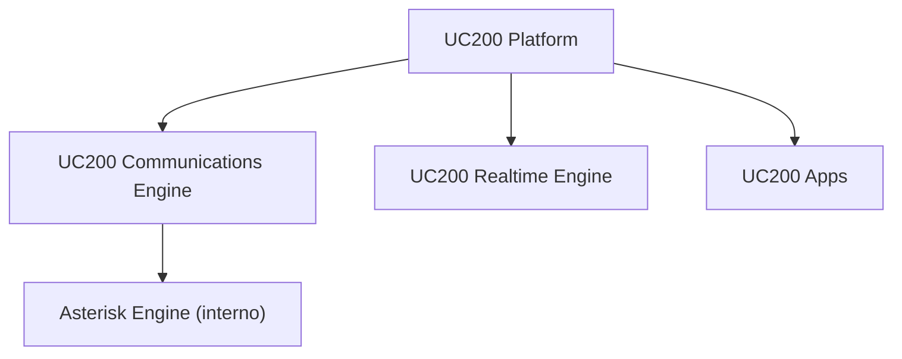

# Product Architecture

UC200 se presenta como una plataforma UCaaS moderna con capas separadas para producto, comunicaciones, realtime y apps cliente.

## Capas

- **UC200 Platform**: identidad, permisos, CRM, billing, provisioning, seguridad, UI y API.
- **UC200 Communications Engine**: llamadas, lineas SIP, reglas de llamada, voicemail, grabacion y automatizacion.
- **UC200 Realtime Engine**: presencia, wallboard, popups y estados en vivo.
- **UC200 Apps**: Web Client, PWA, desktop y mobile.
- **Asterisk Engine interno**: motor encapsulado; no forma parte del lenguaje visible para usuario final.

## Principios UX

- El usuario administra identidades, no endpoints.
- El usuario elige experiencias cliente, no objetos SIP.
- Los detalles tecnicos quedan en modo avanzado para superadmin/engineer.
- La documentacion visible usa lenguaje UC200; la documentacion interna puede mencionar el motor tecnico.

## Roadmap de apps

- UC200 Web Softphone
- UC200 Mobile iOS/Android
- UC200 Desktop Windows
- UC200 Desktop macOS
- UC200 PWA
- Browser extension futura
