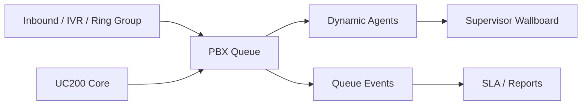

# Queue / Call Center

UC200 incluye una capa inicial de Call Center enterprise para administrar queues, agentes dinamicos, wallboard, eventos y reportes por tenant.

## Arquitectura



## Componentes

- `pbx_queues`: configuracion de queue, estrategia, tiempos, anuncios y destinos.
- `pbx_queue_members`: agentes dinamicos por queue, penalties y pausa.
- `pbx_queue_agent_states`: estado realtime de agente.
- `pbx_queue_pause_reasons`: razones de pausa por tenant.
- `pbx_queue_events`: eventos de queue, agente y llamada.
- `pbx_queue_metrics`: metricas agregadas para wallboard y reportes.

## Estrategias

Soportadas en UI y base de datos:

- `ringall`
- `leastrecent`
- `fewestcalls`
- `random`
- `rrmemory`
- `linear`

## Flujo de llamada

1. Una ruta inbound, IVR o ring group envia la llamada a una queue.
2. La queue aplica estrategia, `timeout`, `retry`, `wrapup` y limite de callers.
3. Si no hay respuesta o se supera capacidad, usa `overflow_destination`.
4. Si hay error de ruta, usa `failover_destination`.
5. Los eventos alimentan wallboard y reportes.

## Dialplan base

El dialplan debe resolver queues por tenant. Ejemplo conceptual:

```ini
exten => _X!,1,NoOp(Queue route)
 same => n,Set(SOURCE_ENDPOINT=${CHANNEL(endpoint)})
 same => n,Set(TENANT=${CUT(SOURCE_ENDPOINT,_,2)})
 same => n,Queue(tenant_${TENANT}_${EXTEN},t,,,${QUEUE_TIMEOUT})
 same => n,Goto(queue-failover,s,1)
```

Para Asterisk Realtime, puedes mapear `pbx_queues.extension` a nombres internos como:

```text
tenant_{company_id}_{queue_extension}
```

## Agentes

Los agentes se gestionan como miembros dinamicos:

- Login/logout.
- Pause/unpause.
- Pause reason.
- Penalty.
- Estados: `offline`, `online`, `paused`, `ringing`, `in_call`, `wrapup`.

Supervisor features quedan preparadas por eventos y estados:

- Monitor.
- Whisper.
- Barge.
- Spy.
- Force pause.

## Wallboard

`/call-center` muestra:

- Waiting calls.
- Active calls.
- Abandoned calls.
- SLA.
- Agents online.
- Paused agents.
- Average hold time.
- Average talk time.

El endpoint `/call-center/wallboard` entrega JSON para refresco realtime desde UI autenticada.

## API

Endpoints read-only con PAT:

- `GET /api/v1/queues`
- `GET /api/v1/queue-agents`
- `GET /api/v1/queue-events`
- `GET /api/v1/queue-metrics`

Scopes:

- `queues:read`
- `queue_agents:read`
- `queue_events:read`
- `queue_metrics:read`

## Seguridad

- Todas las tablas incluyen `company_id`.
- La UI filtra por tenant salvo `super-admin`.
- Al agregar agentes se valida ownership del endpoint.
- Los eventos preservan `company_id`, `queue_id`, `endpoint_id` y `call_id`.

## Instalacion

```bash
mysql -u uc200_user -p uc200_core < database/updates/2026_05_18_queue_call_center.sql
asterisk -rx "dialplan reload"
```
