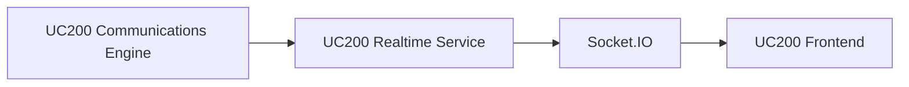

# Realtime Engine

UC200 incluye una base realtime enterprise con un servicio NodeJS independiente que publica eventos al frontend mediante Socket.IO. La experiencia visible habla de presencia, actividad y actualizaciones en vivo; la integracion con el motor de comunicaciones queda encapsulada.

Arquitectura:



## Objetivo

- presencia UC200 en vivo
- badges y estados sin refresh
- popup de llamada
- activity feed listo para CRM y call center
- base multi tenant para growth tipo 3CX / Teams / Webex

## Servicio

El codigo versionado vive en:

```text
services/uc200-realtime
```

El despliegue recomendado en servidor es:

```text
/opt/uc200-realtime
```

Archivos principales:

- `server.js`
- `ami.js`
- `socket.js`
- `presence.js`
- `queue.js`
- `systemd/uc200-realtime.service`

## Variables ENV

Ejemplo:

```env
PORT=3100
HOST=127.0.0.1
CORS_ORIGIN=https://uc200.gsite.mx
SOCKET_IO_PATH=/socket.io
AMI_HOST=127.0.0.1
AMI_PORT=5038
AMI_USERNAME=admin
AMI_PASSWORD=changeme
AMI_RECONNECT_DELAY_MS=3000
AMI_PING_INTERVAL_MS=15000
JWT_SECRET=change-me
REDIS_URL=
LOG_LEVEL=info
```

`JWT_SECRET` debe coincidir con la logica de UC200 para tokens realtime. La forma mas simple es fijar `REALTIME_JWT_SECRET` en UC200 y usar el mismo valor aqui.

## Eventos AMI capturados

- `PeerStatus`
- `ExtensionStatus`
- `Newchannel`
- `Hangup`
- `BridgeEnter`
- `BridgeLeave`
- `QueueCallerJoin`
- `QueueCallerLeave`
- `AgentConnect`
- `AgentComplete`
- `DialBegin`
- `DialEnd`

## Eventos Socket.IO emitidos

- `extension_status`
- `active_call`
- `queue_update`
- `call_popup`
- `realtime_stats`

## Seguridad

- JWT corto emitido por UC200 en `/api/v1/realtime/token`
- aislamiento por `company_id`
- rooms por tenant, usuario y endpoint
- rate limit en emision de token desde PHP
- el frontend no guarda secretos AMI ni SIP administrativos

## Reverse proxy

Publica Socket.IO por el mismo dominio del panel, sin exponer el puerto interno:

Apache:

```apache
ProxyPass "/socket.io/"  "http://127.0.0.1:3100/socket.io/"
ProxyPassReverse "/socket.io/"  "http://127.0.0.1:3100/socket.io/"
```

Nginx:

```nginx
location /socket.io/ {
    proxy_pass http://127.0.0.1:3100/socket.io/;
    proxy_http_version 1.1;
    proxy_set_header Upgrade $http_upgrade;
    proxy_set_header Connection "Upgrade";
    proxy_set_header Host $host;
}
```

## systemd

Referencia:

```text
services/uc200-realtime/systemd/uc200-realtime.service
```

Instalacion tipica:

```bash
sudo cp -R services/uc200-realtime /opt/uc200-realtime
cd /opt/uc200-realtime
npm install
cp .env.example .env
sudo cp systemd/uc200-realtime.service /etc/systemd/system/uc200-realtime.service
sudo systemctl daemon-reload
sudo systemctl enable --now uc200-realtime
```

## Puertos

- `5038/tcp` AMI interno
- `3100/tcp` servicio realtime interno
- `443/tcp` panel/proxy publico

No se recomienda publicar `3100` ni `5038` a internet.

## Redis / HA

La primera fase queda lista para crecer:

- `REDIS_URL` reservado para adapter distribuido
- rooms por tenant separadas
- servicio stateless salvo memoria temporal de presencia
- listo para mover snapshots o adapters a Redis en fase posterior

## Troubleshooting

- `Realtime offline` en la UI:
  - validar `systemctl status uc200-realtime`
  - revisar `journalctl -u uc200-realtime -f`
  - confirmar proxy `/socket.io/`
- `Invalid signature`:
  - revisar que `JWT_SECRET` coincida con `REALTIME_JWT_SECRET`
- sin eventos de presencia:
  - validar AMI user, permisos y `manager.conf`
- presencia incompleta:
  - revisar nombres endpoint `tenant_{company_id}_{extension}`
- queue stats vacias:
  - confirmar que los eventos AMI de queue estan habilitados y que el canal permite inferir tenant
