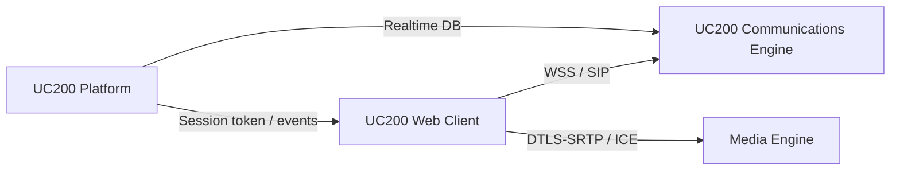

# WebRTC + Web Softphone

UC200 incluye una plataforma WebRTC enterprise para operar el cliente web integrado del producto. En esta fase ya queda conectada con CRM, automatizacion de llamadas y dashboard de comunicaciones para dar una experiencia moderna tipo UCaaS desde navegador.

## Arquitectura



## Componentes

- `transport-wss` en `ps_transports`.
- Columnas WebRTC en `ps_endpoints`:
  - `webrtc`
  - `media_encryption`
  - `dtls_auto_generate_cert`
  - `ice_support`
  - `use_avpf`
  - `rtcp_mux`
- Preferencias de usuario en `webphone_user_preferences`.
- Configuracion tenant/global en `webphone_settings`.
  - `enable_webrtc`
  - `websocket_port`
  - `websocket_path`
  - `stun_server`
  - `turn_server`
  - `dtls_enabled`
  - `ice_enabled`
- Presencia en `pbx_presence_states`.
- Eventos y sincronizacion en `webphone_call_events`.
- Historial softphone en `webphone_recent_calls`.
- Token efimero en `webrtc_session_tokens`.
- Rate limit reutilizando `api_rate_limits` para bootstrap y eventos WebRTC.
- Runtime service en `SoftphoneService` y generador de credenciales SIP en `SipCredentialGenerator`.

## Flujo

1. Usuario abre `/softphone`.
2. UC200 entrega config runtime con extension, auth SIP, ruta WSS, STUN/TURN y token temporal.
3. El frontend construye por defecto `wss://{dominio_actual}/ws`.
4. Llamadas usan DTLS/SRTP e ICE.
5. El navegador reporta eventos a `/api/v1/webrtc/events`.
6. UC200 resuelve caller ID contra CRM y muestra nombre, empresa e historial reciente.
7. UC200 guarda recientes, presencia y preferencias.
8. La presencia se sincroniza como `available`, `ringing`, `busy` u `offline` segun el ciclo de llamada.
9. El motor realtime de UC200 publica eventos via Socket.IO para presencia, popup de llamada y KPIs live sin refresh.

## Softphone Web

El softphone usa SIP.js y queda integrado en `/softphone` con:

- Registro y unregister por SIP sobre WebSocket seguro.
- Marcar extension/numero, recibir llamadas, colgar, mute, hold, DTMF y transfer.
- Modo dock y modo minimizado para operar como consola flotante.
- Seleccion de microfono/speaker, volumen de timbre, volumen de salida y prueba de audio.
- Constraints de audio con echo cancellation, noise suppression y auto gain control.
- Notificaciones del navegador para llamadas entrantes.
- Preparacion BLF/presencia con estados live por endpoint.
- Caller ID inteligente con lookup en CRM por movil, oficina o DID.
- Contexto visual de contacto con empresa y ultimas interacciones.
- Click-to-call via PBX/AMI cuando el usuario prefiere originar desde su extension.

Los navegadores requieren HTTPS valido para microfono, notificaciones y WSS.

## Endpoints API

- `GET /api/v1/webrtc/config`
- `GET /api/v1/webrtc/token`
- `GET /api/v1/webrtc/status`
- `POST /api/v1/webrtc/preferences`
- `POST /api/v1/webrtc/presence`
- `POST /api/v1/webrtc/events`

`/api/v1/webrtc/config` y `/token` requieren sesion UC200. El frontend no incrusta credenciales SIP en el HTML; las obtiene bajo sesion y con token temporal corto para eventos y estado. Esto no elimina por completo la necesidad de credenciales SIP en navegador, pero evita exponerlas en plantillas o almacenarlas de forma persistente.

## Puertos firewall

Minimo recomendado:

```bash
iptables -A INPUT -p tcp --dport 443 -j ACCEPT
iptables -A INPUT -p udp --dport 10000:20000 -j ACCEPT
iptables -A INPUT -p udp --dport 3478 -j ACCEPT
iptables -A INPUT -p tcp --dport 5349 -j ACCEPT
```

Usa `443` para la app HTTPS, `10000:20000/udp` para RTP y `3478/5349` si despliegas TURN. El WebSocket SIP debe entrar por el mismo dominio del panel y pasar por proxy reverse hacia `127.0.0.1:8088/ws`, sin exponer Asterisk HTTP publicamente.

## Motor interno

Ejemplo base:

```ini
; http.conf
[general]
enabled=yes
bindaddr=0.0.0.0
bindport=8088
tlsenable=yes
tlsbindaddr=0.0.0.0:8089
tlscertfile=/etc/asterisk/keys/fullchain.pem
tlsprivatekey=/etc/asterisk/keys/privkey.pem

; rtp.conf
[general]
rtpstart=10000
rtpend=20000
icesupport=yes
stunaddr=stun.l.google.com:19302
```

El transporte realtime `transport-wss` queda creado por la migracion. Para cada extension, usa `Enable WebRTC` en `/softphone`. El modo recomendado es **WebRTC integrado**, donde el navegador usa `wss://{dominio_actual}/ws` y Apache/Nginx reenvia a `127.0.0.1:8088/ws`. El panel PBX permite ajustar:

- `Enable WebRTC`
- `WebSocket path`
- `WebSocket port` en opciones avanzadas
- `WebSocket URL override` en opciones avanzadas
- `STUN server`
- `TURN server`
- `DTLS enable`
- `ICE support`
- `Session timeout`

## Proxy recomendado

Apache:

```apache
ProxyPass "/ws" "ws://127.0.0.1:8088/ws"
ProxyPassReverse "/ws" "ws://127.0.0.1:8088/ws"
```

Nginx:

```nginx
location /ws {
    proxy_pass http://127.0.0.1:8088/ws;
    proxy_http_version 1.1;
    proxy_set_header Upgrade $http_upgrade;
    proxy_set_header Connection "Upgrade";
    proxy_set_header Host $host;
}
```

La idea es que el WebSocket interno quede escuchando solo en localhost o red interna, mientras el panel publica un unico endpoint seguro `wss://{dominio_actual}/ws`.

## STUN/TURN

STUN publico sirve para pruebas. Para produccion usa TURN propio, por ejemplo coturn:

```bash
listening-port=3478
tls-listening-port=5349
fingerprint
lt-cred-mech
realm=pbx.example.com
user=uc200:strong-secret
cert=/etc/letsencrypt/live/pbx.example.com/fullchain.pem
pkey=/etc/letsencrypt/live/pbx.example.com/privkey.pem
```

Guarda las URLs en `webphone_settings.turn_urls` como JSON:

```json
["turn:pbx.example.com:3478?transport=udp","turns:pbx.example.com:5349?transport=tcp"]
```

## Compatibilidad

- Chrome y Edge: soporte completo esperado.
- Firefox: soporte WebRTC completo; salida de audio por `setSinkId` puede variar.
- Safari: soporte basico; algunas APIs de seleccion de speaker/notificaciones son limitadas.

## Troubleshooting

- Registro falla: valida certificado WSS, `http show status`, `pjsip show transport transport-wss`.
- Llamada sin audio: revisa `rtp set debug on`, puertos RTP, `external_media_address`, STUN/TURN.
- Error DTLS: confirma certificado, `media_encryption=dtls`, `dtls_auto_generate_cert=yes`.
- Solo una via de audio: activa TURN y verifica NAT/firewall.
- Browser bloquea microfono: revisar permisos del sitio y HTTPS valido.
- Eventos rechazados: confirma que el token `uc200_webrtc_*` no haya expirado y que no se haya excedido el rate limit.

## Instalacion

```bash
mysql -u uc200_user -p uc200_core < database/updates/2026_05_15_webrtc_softphone.sql
asterisk -rx "pjsip reload"
asterisk -rx "module reload res_http_websocket.so"
```
